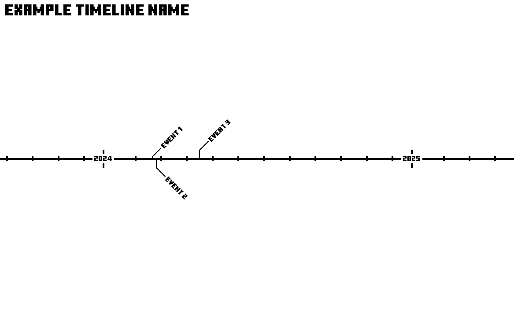

# Timeline Creator

Made by [@TauCommands](https://github.com/TenCommands) & [@RavenKing-cloud](https://github.com/RavenKing-cloud)

## Requirements:

PIL
```pip install --upgrade PILLOW```

PyQt5
```pip install --upgrade PyQt5```

## How to use:

1. Run the `run.bat` file within the project folder
2. Click `Open JSON File` and select a JSON file containing the proper values
3. You can now see your timeline image in the window which you can find in the `export` folder
4. You can edit the timeline using the `json` file syntax below:

```json
{
    "timeline_name": "Example Timeline Name",
    "start_date": [1,1,2024],
    "end_date": [1,1,2025],
    "events": [
            {
                "name": "Event 1",
                "date": [2,29,2024],
                "description": "",
                "images": []
            },
            {
                "name": "Event 2",
                "date": [3,3,2024],
                "description": "",
                "images": []
            },
            {
                "name": "Event 3",
                "date": [4,24,2024],
                "description": "",
                "images": []
            }
    ]
}
```

The `start` and `end` dates are given a 6 month padding to the edge of the image so you can see the year markers better.

This example leaves you with this:



Please note that the order you enter them into the json file does matter! You should always enter the events in chronological order!*

### Todo

- [x] toolbar
  - [x] create timeline file
  - [x] add event to timeline
    - [x] modify logic to sort and overwrite json data
- [ ] hover on event to view tooltip
  - [ ] pop out display with image and (live edit*)
      - [ ] delete button with confirmation
- [ ] modify render code to prevent overlapping
  - [ ] event overlap
  - [ ] year text overlap
